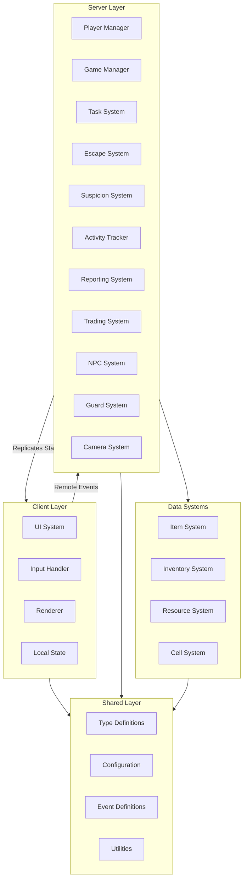

# Jail Escape - Architecture Design Document

## Overview

This document outlines the technical architecture for the Jail Escape game. The system is designed to be **modular**, **scalable**, and **maintainable**, allowing for easy addition of new features, escape methods, prisons, and game modes.

---

## Architecture Principles

1. **Modularity**: Each system is self-contained with clear interfaces
2. **Scalability**: Systems can handle 1-12 players without performance degradation
3. **Extensibility**: New escape methods, items, tasks can be added without modifying core systems
4. **Separation of Concerns**: Client, Server, and Shared code are clearly separated
5. **Data-Driven**: Configuration separated from logic (escape methods, items, tasks in data files)
6. **Event-Driven**: Systems communicate via events to maintain loose coupling

---

## System Architecture Diagram



---

## Core Module Breakdown

### 1. Player Management System

**Purpose**: Handle player joining, cell assignment, team management, and initialization.

**Key Responsibilities**:
- Wait 10 seconds after first player joins
- Assign players to cells
- Fill empty slots with NPCs
- Manage team assignments
- Handle player disconnections
- Spawn players in cells

**Modules**:
- `PlayerManager`: Main player lifecycle management
- `CellAssignment`: Cell assignment logic
- `TeamManager`: Team formation and management

**Dependencies**:
- NPC System (for filling empty slots)
- Cell System (for assignment)

---

### 2. Activity Tracking System

**Purpose**: Track all player activities for reporting verification and suspicion calculation.

**Key Responsibilities**:
- Log player actions with timestamps
- Track location visits
- Track item usage
- Track task completions
- Track escape method progress
- Filter suspicious activities
- Provide activity history per day

**Data Structure**:
```lua
ActivityLog = {
    [playerId] = {
        [day] = {
            activities = Array<{
                timestamp: number,
                type: ActivityType,
                location: Vector3,
                details: any
            }>
        }
    }
}
```

**Modules**:
- `ActivityTracker`: Main tracking logic
- `ActivityLogger`: Logging implementation
- `ActivityFilter`: Filtering suspicious activities

**Dependencies**:
- None (core system)

---

### 3. Suspicion System

**Purpose**: Calculate suspicion levels, trigger guard interactions, manage guard responses.

**Key Responsibilities**:
- Calculate suspicion based on behavior
- Track location frequency
- Monitor contraband possession
- Detect unusual behavior
- Trigger guard investigations
- Manage suspicion decay
- Handle automatic solitary triggers (late to cell, disobeying guards)

**Modules**:
- `SuspicionCalculator`: Core suspicion calculation
- `SuspicionTracker`: Per-player suspicion tracking
- `BehaviorAnalyzer`: Analyze behavior patterns

**Dependencies**:
- Activity Tracking System
- Guard System
- Item System

---

### 4. Guard System

**Purpose**: Manage guard NPCs, patrols, interactions, investigations, and warden AI.

**Key Responsibilities**:
- Guard patrol routes (pathfinding)
- Camera monitoring
- Investigation system
- Physical guard-player interactions
- Warden task management
- Warden AI decision-making
- Escalating responses based on suspicion

**Modules**:
- `GuardManager`: Main guard system
- `GuardPatrol`: Patrol route management
- `GuardInvestigation`: Investigation logic
- `WardenAI`: Intelligent warden behavior
- `CameraSystem`: Security camera monitoring

**Dependencies**:
- NPC System (base NPC functionality)
- Pathfinding Service
- Suspicion System

---

### 5. Escape Methods System

**Purpose**: Modular system for managing all escape methods and their progress.

**Key Responsibilities**:
- Track progress for each escape method
- Validate method requirements
- Handle method completion
- Support multiple simultaneous methods
- Calculate escape completion percentage

**Design Pattern**: Strategy Pattern - each escape method is a separate module

**Modules**:
- `EscapeMethodManager`: Main escape system coordinator
- `EscapeMethod` (abstract base class)
  - `FenceCuttingMethod`
  - `GuardDisguiseMethod`
  - `CellDiggingMethod`
  - `ParoleMethod`
  - `CartelBreakoutMethod`

**Data Structure**:
```lua
EscapeMethod = {
    id: string,
    name: string,
    requirements: Array<Requirement>,
    steps: Array<Step>,
    progress: number, -- 0-100
    completedSteps: Array<StepId>
}
```

**Dependencies**:
- Item System (for requirements)
- Activity Tracking System (for progress)
- Cell System (for cell photo updates)

---

### 6. Task System

**Purpose**: Manage task generation, assignment, completion, and rewards.

**Key Responsibilities**:
- Generate tasks dynamically
- Assign tasks to players/NPCs
- Track task completion
- Distribute rewards
- Manage task categories (labor, skilled, illegal, super illegal, rehabilitation)
- Task board management

**Modules**:
- `TaskManager`: Main task system
- `TaskGenerator`: Generate tasks dynamically
- `TaskBoard`: Job board management
- `TaskCategory`: Task type definitions

**Data Structure**:
```lua
Task = {
    id: string,
    name: string,
    category: TaskCategory,
    suspicionLevel: number,
    pay: number,
    timeRequired: number,
    requirements: Array<Requirement>,
    location: Vector3,
    assignedTo: PlayerId | null
}
```

**Dependencies**:
- NPC System (for NPC task assignment)
- Resource System (for rewards)

---

### 7. Trading System

**Purpose**: Handle all trading mechanics including common board, direct trading, and NPC trading.

**Key Responsibilities**:
- Common cell board management
- Anonymous posting system
- Receipt generation and visibility
- Direct player-to-player trading
- NPC trading (item-based, not just money)
- Item availability tracking

**Modules**:
- `TradingManager`: Main trading coordinator
- `CommonBoard`: Trading board system
- `ReceiptSystem`: Receipt tracking and display
- `ItemTracker`: Track items in prison

**Dependencies**:
- Item System
- Inventory System
- Resource System

---

### 8. Inventory System (Grid-Based)

**Purpose**: Manage grid-based inventory with space-based item placement.

**Key Responsibilities**:
- Grid layout management
- Item placement and rotation
- Space validation
- Carry capacity limits
- Item stacking logic
- Inventory UI

**Modules**:
- `InventoryManager`: Main inventory system
- `InventoryGrid`: Grid layout logic
- `ItemPlacement`: Placement and validation
- `InventoryUI`: Client-side inventory interface

**Data Structure**:
```lua
Inventory = {
    grid: Array<Array<Cell>>, -- 2D grid
    width: number,
    height: number,
    items: Array<InventoryItem>
}

InventoryItem = {
    itemId: string,
    position: {x: number, y: number},
    rotation: number,
    size: {width: number, height: number}
}
```

**Dependencies**:
- Item System (item definitions)

---

### 9. Item System

**Purpose**: Define and manage all items in the game.

**Key Responsibilities**:
- Item definitions
- Item properties (size, type, suspicion value)
- Item spawning
- Item interaction
- Item availability control

**Design**: Data-driven - items defined in configuration files

**Modules**:
- `ItemManager`: Main item system
- `ItemDefinition`: Item data structure
- `ItemSpawner`: Item spawning logic

**Data Structure**:
```lua
ItemDefinition = {
    id: string,
    name: string,
    category: ItemCategory,
    gridSize: {width: number, height: number},
    suspicionValue: number,
    properties: Map<string, any>
}
```

**Dependencies**:
- None (core system)

---

### 10. NPC System

**Purpose**: Base NPC functionality for guards, inmates, and warden.

**Key Responsibilities**:
- NPC spawning and management
- Pathfinding for NPCs
- NPC behavior trees
- NPC interactions
- NPC task assignment
- Solo mode AI difficulty

**Modules**:
- `NPCManager`: Main NPC system
- `NPCBase`: Base NPC class
  - `GuardNPC`: Guard-specific behavior
  - `InmateNPC`: Inmate-specific behavior
  - `WardenNPC`: Warden-specific behavior
- `NPCBehaviorTree`: Behavior tree system
- `NPCPathfinding`: Pathfinding wrapper

**Dependencies**:
- Pathfinding Service (Roblox PathfindingService)
- Task System
- Trading System

---

### 11. Reporting System

**Purpose**: Handle player reports, verification, and outcomes.

**Key Responsibilities**:
- Accept player reports
- Verify reports against activity log
- Determine report outcomes
- Apply rewards/penalties
- Track false reports

**Modules**:
- `ReportingManager`: Main reporting system
- `ReportVerifier`: Verify reports against activity log
- `ReportProcessor`: Process report outcomes

**Dependencies**:
- Activity Tracking System
- Guard System (for sending to solitary)

---

### 12. Cell System

**Purpose**: Manage player cells, photo system, and cell interactions.

**Key Responsibilities**:
- Cell assignment and management
- Photo interaction system
- Display escape progress on photo
- Cell storage (hidden items)

**Modules**:
- `CellManager`: Main cell system
- `CellPhoto`: Photo interaction and display
- `CellStorage`: Hidden item storage

**Dependencies**:
- Escape Methods System (for progress display)

---

### 13. Resource System

**Purpose**: Manage money and resource distribution.

**Key Responsibilities**:
- Money management
- Resource tracking
- Item economy balance
- Resource distribution

**Modules**:
- `ResourceManager`: Main resource system
- `MoneyTracker`: Money management

**Dependencies**:
- Item System

---

### 14. Game Manager

**Purpose**: Orchestrate game initialization, game state, and mode management.

**Key Responsibilities**:
- Game initialization
- Game mode management (Free for All, Teams, Solo)
- Game state tracking
- Win condition detection
- Game session management

**Modules**:
- `GameManager`: Main game coordinator
- `GameMode`: Game mode definitions
- `GameState`: Game state management

**Dependencies**:
- Player Management System
- All other systems (orchestrates them)

---

## Module Communication

### Event System

Systems communicate via an event bus to maintain loose coupling:

**Event Types**:
- `ActivityEvents`: Activity tracking events
- `SuspicionEvents`: Suspicion change events
- `EscapeEvents`: Escape method progress events
- `TaskEvents`: Task-related events
- `TradingEvents`: Trading events
- `GuardEvents`: Guard interaction events

**Implementation**: Use BindableEvents or RemoteEvents depending on client/server communication needs.

---

## Data Flow

### Player Activity Flow

```
Player Action → Activity Tracker → Suspicion System → Guard System
                                      ↓
                                 Guard Response
```

### Escape Progress Flow

```
Player Action → Escape Method → Progress Update → Cell Photo → UI Update
```

### Reporting Flow

```
Player Report → Reporting System → Activity Tracker (verification) → Outcome → Guard System (if applicable)
```

---

## Scalability Considerations

### Performance Optimization

1. **Activity Logging**: Use efficient data structures, consider batching
2. **Suspicion Calculation**: Cache calculations, update incrementally
3. **NPC Pathfinding**: Limit concurrent pathfinding operations
4. **Inventory Grid**: Use spatial indexing for quick lookups
5. **Event System**: Debounce/throttle where appropriate

### Memory Management

1. **Activity Logs**: Archive old logs, limit per-day history
2. **Item Tracking**: Use object pooling for frequently spawned items
3. **NPC Instances**: Reuse NPC instances when possible

---

## Extension Points

### Adding New Escape Methods

1. Create new class extending `EscapeMethod` base
2. Define requirements, steps, and progress logic
3. Register in `EscapeMethodManager`
4. Add configuration to escape methods data file

### Adding New Prisons

1. Create prison layout data file
2. Define cell locations, task board locations, etc.
3. Prison-specific configuration
4. System automatically loads based on selected prison

### Adding New Items

1. Add item definition to items configuration file
2. Define properties (size, suspicion, category)
3. Add to item spawner if needed
4. Integrate with trading system if tradeable

### Adding New Tasks

1. Define task in task configuration file
2. Set category, pay, suspicion level
3. Define requirements and location
4. Task generator automatically includes it

---

## Technology Stack

### Roblox Services Used

- **ReplicatedStorage**: Shared code and events
- **ServerScriptService**: Server-side systems
- **StarterPlayer**: Client-side code
- **Workspace**: Game world and instances
- **PathfindingService**: NPC pathfinding
- **RunService**: Game loops and timers
- **CollectionService**: Tagging and organization

### External Dependencies

- **Rojo**: Code organization and synchronization
- **Luau**: Roblox's Lua dialect
- **TypeScript types** (optional): For better IDE support

---

## Security Considerations

1. **Client-Server Validation**: All critical actions validated server-side
2. **Anti-Exploit**: Rate limiting, sanity checks
3. **Data Integrity**: Server-authoritative game state
4. **Cheat Prevention**: Critical calculations server-side only

---

## Testing Strategy

### Unit Testing

- Test individual modules in isolation
- Mock dependencies for testing
- Test edge cases and error handling

### Integration Testing

- Test system interactions
- Test event flows
- Test data consistency

### Performance Testing

- Load testing with 12 players
- NPC performance with many NPCs
- Memory leak detection

---

## Future Enhancements

1. **Replay System**: Record and replay matches
2. **Analytics**: Track player behavior and balance metrics
3. **Matchmaking**: Skill-based matchmaking for teams
4. **Progression System**: Unlocks and character progression
5. **Multiple Prisons**: Modular prison system expansion

---

**Document Version**: 1.0  
**Last Updated**: [Current Date]  
**Status**: Architecture Design Complete
